```mermaid
flowchart LR
    A[🔧 Local Testing] --> B[📂 GitHub Push]
    B --> D[⚙️ Jenkins]
    
    subgraph "Google Cloud VPS"
        D
        E[🐳 Docker Build]
        F[🚀 Deploy]
        G[📦 MySQL DB]
        H[🌐 WordPress]
        I[🔧 phpMyAdmin]
        J[🛡️ Nginx Proxy]
    end
    D --> E
    E --> F
    F --> G
    F --> H
    F --> I
    F --> J
    
    subgraph "Security Features"
        K[🚦 Rate Limiting]
        L[🗜️ Gzip Compression]
        M[🔒 Security Headers]
        N[🚫 Bot Protection]
    end
    
    J --> K
    J --> L
    J --> M
    J --> N
    
    style A fill:#ff6b6b,stroke:#333,stroke-width:2px,color:#fff
    style B fill:#4ecdc4,stroke:#333,stroke-width:2px,color:#fff

    style D fill:#96ceb4,stroke:#333,stroke-width:2px,color:#fff
    style E fill:#feca57,stroke:#333,stroke-width:2px,color:#fff
    style F fill:#ff9ff3,stroke:#333,stroke-width:2px,color:#fff
    style G fill:#e74c3c,stroke:#333,stroke-width:2px,color:#fff
    style H fill:#3498db,stroke:#333,stroke-width:2px,color:#fff
    style I fill:#9b59b6,stroke:#333,stroke-width:2px,color:#fff
    style J fill:#2ecc71,stroke:#333,stroke-width:2px,color:#fff
    style K fill:#f39c12,stroke:#333,stroke-width:2px,color:#fff
    style L fill:#1abc9c,stroke:#333,stroke-width:2px,color:#fff
    style M fill:#e67e22,stroke:#333,stroke-width:2px,color:#fff
    style N fill:#c0392b,stroke:#333,stroke-width:2px,color:#fff
```

# 🚀 WordPress Docker CI/CD Pipeline with Jenkins

A complete DevOps solution for WordPress deployment using Docker, Nginx, MySQL, phpMyAdmin, and Jenkins CI/CD pipeline with advanced security features.

## 🏗️ Architecture Overview

This setup provides a robust, scalable WordPress deployment with the following components:

- **WordPress** - Main application server
- **MySQL 5.7** - Database server with persistent storage
- **phpMyAdmin** - Database management interface
- **Nginx** - Reverse proxy with load balancing, rate limiting, and security headers
- **Jenkins** - CI/CD automation server

## 🎯 Features

### 🔒 Security Features
- Rate limiting (100 requests/minute)
- Connection limiting (20 concurrent connections)
- Security headers (X-Frame-Options, X-Content-Type-Options, etc.)
- Bot protection with user-agent filtering
- Gzip compression for performance

### 🛡️ Production-Ready Components
- Automated CI/CD pipeline
- Container orchestration with Docker Compose
- Persistent data volumes
- Network isolation
- Health checks and auto-restart

## 📋 Prerequisites

### System Requirements
- **OS**: Linux (Ubuntu 20.04+ recommended), macOS, or Windows with WSL2
- **RAM**: Minimum 4GB (8GB recommended)
- **Storage**: 20GB free space
- **Network**: Internet connection for downloading images

### Required Software
- Docker Engine 20.10+
- Docker Compose 2.0+
- Git
- Text editor (VS Code, nano, vim)

## 🔧 Installation Guide

### Step 1: Install Docker

#### Ubuntu/Debian
```bash
# Update package index
sudo apt update

# Install required packages
sudo apt install -y apt-transport-https ca-certificates curl gnupg lsb-release

# Add Docker's official GPG key
curl -fsSL https://download.docker.com/linux/ubuntu/gpg | sudo gpg --dearmor -o /usr/share/keyrings/docker-archive-keyring.gpg

# Add Docker repository
echo "deb [arch=$(dpkg --print-architecture) signed-by=/usr/share/keyrings/docker-archive-keyring.gpg] https://download.docker.com/linux/ubuntu $(lsb_release -cs) stable" | sudo tee /etc/apt/sources.list.d/docker.list > /dev/null

# Install Docker Engine
sudo apt update
sudo apt install -y docker-ce docker-ce-cli containerd.io docker-compose-plugin

# Add user to docker group
sudo usermod -aG docker $USER
newgrp docker
```

#### CentOS/RHEL
```bash
# Install required packages
sudo yum install -y yum-utils

# Add Docker repository
sudo yum-config-manager --add-repo https://download.docker.com/linux/centos/docker-ce.repo

# Install Docker
sudo yum install -y docker-ce docker-ce-cli containerd.io docker-compose-plugin

# Start and enable Docker
sudo systemctl start docker
sudo systemctl enable docker

# Add user to docker group
sudo usermod -aG docker $USER
```

#### macOS
```bash
# Install using Homebrew
brew install docker docker-compose

# Or download Docker Desktop from https://www.docker.com/products/docker-desktop
```

### Step 2: Verify Installation
```bash
# Check Docker version
docker --version

# Check Docker Compose version
docker compose version

# Test Docker installation
docker run hello-world
```

## 🚀 Quick Start

### Step 1: Clone the Repository
```bash
git clone https://github.com/your-username/wordpress-docker-cicd.git
cd wordpress-docker-cicd
```

### Step 2: Project Structure
```
wordpress-docker-cicd/
├── docker-compose.yml          # Main orchestration file
├── docker-compose.local.yml    # Local development version
├── nginx/
│   └── default.conf            # Nginx configuration
├── jenkins/
│   └── Dockerfile.jenkins      # Jenkins container setup
├── Dockerfile                  # WordPress container
├── Jenkinsfile                 # CI/CD pipeline
└── README.md                   # This file
```

### Step 3: Configure Environment

#### Create Nginx Configuration
```bash
# Create nginx directory
mkdir -p nginx

# Create advanced nginx configuration
cat > nginx/default.conf << 'EOF'
# Global settings
limit_req_zone $binary_remote_addr zone=mylimit:10m rate=100r/m;
limit_conn_zone $binary_remote_addr zone=connlimit:10m;

gzip on;
gzip_min_length 1024;
gzip_types text/plain text/css application/json application/javascript text/xml application/xml application/font-woff application/font-woff2 application/vnd.ms-fontobject;

server_tokens off;

server {
    listen 80;
    server_name _;

    # Limits
    limit_conn connlimit 20;
    client_max_body_size 10m;

    # Security headers
    add_header X-Frame-Options "SAMEORIGIN" always;
    add_header X-Content-Type-Options "nosniff" always;
    add_header X-XSS-Protection "1; mode=block" always;
    add_header Referrer-Policy "no-referrer" always;

    # Cache for uploads
    location ^~ /wp-content/uploads/ {
        expires 7d;
        access_log off;
    }

    # phpMyAdmin under /phpmyadmin
    location /phpmyadmin/ {
        limit_req zone=mylimit burst=5 nodelay;
        rewrite ^/phpmyadmin(/.*)$ $1 break;
        proxy_pass http://phpmyadmin_ui:80/;
        proxy_set_header Host $host;
        proxy_set_header X-Real-IP $remote_addr;
        proxy_set_header X-Forwarded-For $proxy_add_x_forwarded_for;
        proxy_set_header X-Forwarded-Proto $scheme;
    }

    # WordPress default root path
    location / {
        limit_req zone=mylimit burst=5 nodelay;
        
        # Basic bot/user-agent filter
        if ($http_user_agent ~* (sqlmap|nikto|fuzzer|scanner|curl|wget|nmap|bot|python|requests|urllib|httpclient|node|axios|go-http|httpie|fetch|scrapy|perl)) {
            return 403;
        }

        proxy_pass http://wordpress_app:80/;
        proxy_set_header Host $host;
        proxy_set_header X-Real-IP $remote_addr;
        proxy_set_header X-Forwarded-For $proxy_add_x_forwarded_for;
        proxy_set_header X-Forwarded-Proto $scheme;
    }
}
EOF
```

### Step 4: Deploy the Stack

#### For Local Development
```bash
# Start all services
docker compose -f docker-compose.local.yml up -d

# Check status
docker compose -f docker-compose.local.yml ps

# View logs
docker compose -f docker-compose.local.yml logs -f
```

#### For Production with CI/CD
```bash
# Start the complete stack including Jenkins
docker compose up -d

# Check all services
docker compose ps

# View logs for specific service
docker compose logs -f wordpress
```

### Step 5: Access Your Services

| Service | URL | Default Credentials |
|---------|-----|-------------------|
| **WordPress** | http://localhost | Setup during first visit |
| **phpMyAdmin** | http://localhost/phpmyadmin | root / bu1_root_secret |
| **Jenkins** | http://localhost:8080 | Setup during first visit |

## 🔧 Configuration

### Environment Variables

You can customize the deployment by modifying these variables in `docker-compose.yml`:

```yaml
environment:
  MYSQL_DATABASE: bu1_portal_db
  MYSQL_USER: bu1_admin
  MYSQL_PASSWORD: bu1_secure_pass
  MYSQL_ROOT_PASSWORD: bu1_root_secret
```

### WordPress Configuration

1. **Access WordPress**: Navigate to `http://localhost`
2. **Setup Database**: Use the following settings:
   - Database Name: `bu1_portal_db`
   - Username: `bu1_admin`
   - Password: `bu1_secure_pass`
   - Database Host: `db`

### Jenkins CI/CD Pipeline

The Jenkins pipeline automatically:
1. Cleans workspace
2. Pulls code from GitHub
3. Creates/updates Nginx configuration
4. Rebuilds containers
5. Deploys the application

#### Pipeline Configuration
```groovy
pipeline {
    agent any
    environment {
        DOCKER_HOST = "unix:///var/run/docker.sock"
    }
    stages {
        stage('Clean Workspace') { /* ... */ }
        stage('Pull Code from GitHub') { /* ... */ }
        stage('Create Nginx Configuration') { /* ... */ }
        stage('Rebuild Containers') { /* ... */ }
    }
}
```

## 🛠️ Management Commands

### Container Management
```bash
# Start services
docker compose up -d

# Stop services
docker compose down

# Restart specific service
docker compose restart wordpress

# Scale WordPress instances
docker compose up -d --scale wordpress=3

# View container logs
docker compose logs -f [service_name]
```

### Database Management
```bash
# Access MySQL directly
docker exec -it mysql_db mysql -u root -p

# Backup database
docker exec mysql_db mysqldump -u root -p bu1_portal_db > backup.sql

# Restore database
docker exec -i mysql_db mysql -u root -p bu1_portal_db < backup.sql
```

### File Management
```bash
# Access WordPress files
docker exec -it wordpress_app bash

# Copy files to/from container
docker cp local_file.php wordpress_app:/var/www/html/
docker cp wordpress_app:/var/www/html/wp-config.php ./
```

## 📊 System Architecture

### Jenkins CI/CD Pipeline Flow



### Jenkins Pipeline Stages

```mermaid
graph TD
    A[🔧 Jenkins Triggered] --> B[🧹 Clean Workspace]
    B --> C[📥 Pull Code from GitHub]
    C --> D[📝 Create Nginx Configuration]
    D --> E[🔍 Verify Nginx Configuration]
    E --> F[🛑 Stop Existing Containers]
    F --> G[🔨 Rebuild Containers]
    G --> H[🚀 Start New Containers]
    H --> I[📁 Copy Nginx Config]
    I --> J[🔄 Reload Nginx]
    J --> K[✅ Deployment Complete]
    
    style A fill:#96ceb4,stroke:#333,stroke-width:2px,color:#fff
    style B fill:#ff6b6b,stroke:#333,stroke-width:2px,color:#fff
    style C fill:#4ecdc4,stroke:#333,stroke-width:2px,color:#fff
    style D fill:#feca57,stroke:#333,stroke-width:2px,color:#fff
    style E fill:#ff9ff3,stroke:#333,stroke-width:2px,color:#fff
    style F fill:#e74c3c,stroke:#333,stroke-width:2px,color:#fff
    style G fill:#3498db,stroke:#333,stroke-width:2px,color:#fff
    style H fill:#2ecc71,stroke:#333,stroke-width:2px,color:#fff
    style I fill:#9b59b6,stroke:#333,stroke-width:2px,color:#fff
    style J fill:#f39c12,stroke:#333,stroke-width:2px,color:#fff
    style K fill:#1abc9c,stroke:#333,stroke-width:2px,color:#fff
```



### Docker Architecture


### Load Balancing Architecture


### Container Orchestration Flow


### System Architecture Overview


### Security Layers
- **Rate Limiting**: 100 requests per minute per IP
- **Connection Limiting**: 20 concurrent connections
- **Security Headers**: XSS, CSRF, and frame protection
- **Bot Protection**: User-agent filtering
- **Gzip Compression**: Improved performance

## 🔍 Monitoring & Troubleshooting

### Health Checks
```bash
# Check container health
docker compose ps

# Check specific service logs
docker compose logs wordpress

# Check resource usage
docker stats

# Check network connectivity
docker network ls
docker network inspect wordpress-docker-cicd_webnet
```

### Common Issues

#### Issue: WordPress can't connect to database
```bash
# Check database container
docker compose logs db

# Verify network connectivity
docker exec wordpress_app ping db
```

#### Issue: Nginx returns 502 Bad Gateway
```bash
# Check WordPress container status
docker compose ps wordpress

# Verify Nginx configuration
docker exec nginx_gateway nginx -t
```

#### Issue: Jenkins can't access Docker
```bash
# Check Docker socket permissions
ls -la /var/run/docker.sock

# Restart Jenkins container
docker compose restart jenkins
```

## 🚀 Production Deployment

### Environment Setup
1. **Server Requirements**:
   - 4GB RAM minimum (8GB recommended)
   - 2 CPU cores minimum
   - 50GB storage
   - Ubuntu 20.04 LTS

2. **Security Hardening**:
   - Change default passwords
   - Enable firewall (UFW)
   - Configure SSL/TLS certificates
   - Set up monitoring

### SSL/HTTPS Configuration
```bash
# Install Certbot
sudo apt install certbot python3-certbot-nginx

# Obtain SSL certificate
sudo certbot --nginx -d yourdomain.com

# Update Nginx configuration for HTTPS
# Add to nginx/default.conf:
server {
    listen 443 ssl;
    ssl_certificate /etc/letsencrypt/live/yourdomain.com/fullchain.pem;
    ssl_certificate_key /etc/letsencrypt/live/yourdomain.com/privkey.pem;
    # ... rest of configuration
}
```

## 🔄 Backup & Recovery

### Automated Backup Script
```bash
#!/bin/bash
# backup.sh
DATE=$(date +%Y%m%d_%H%M%S)
BACKUP_DIR="/backups"

# Create backup directory
mkdir -p $BACKUP_DIR

# Backup database
docker exec mysql_db mysqldump -u root -p bu1_portal_db > $BACKUP_DIR/db_backup_$DATE.sql

# Backup WordPress files
docker exec wordpress_app tar -czf - /var/www/html > $BACKUP_DIR/wordpress_backup_$DATE.tar.gz

echo "Backup completed: $DATE"
```

### Recovery Process
```bash
# Restore database
docker exec -i mysql_db mysql -u root -p bu1_portal_db < db_backup_YYYYMMDD_HHMMSS.sql

# Restore WordPress files
docker exec -i wordpress_app tar -xzf - -C / < wordpress_backup_YYYYMMDD_HHMMSS.tar.gz
```

## 🤝 Contributing

1. Fork the repository
2. Create a feature branch (`git checkout -b feature/amazing-feature`)
3. Commit your changes (`git commit -m 'Add amazing feature'`)
4. Push to the branch (`git push origin feature/amazing-feature`)
5. Open a Pull Request

## 📝 License

This project is licensed under the MIT License - see the [LICENSE](LICENSE) file for details.

### MIT License

```
MIT License

Copyright (c) 2025 WordPress Docker CI/CD Pipeline

Permission is hereby granted, free of charge, to any person obtaining a copy
of this software and associated documentation files (the "Software"), to deal
in the Software without restriction, including without limitation the rights
to use, copy, modify, merge, publish, distribute, sublicense, and/or sell
copies of the Software, and to permit persons to whom the Software is
furnished to do so, subject to the following conditions:

The above copyright notice and this permission notice shall be included in all
copies or substantial portions of the Software.

THE SOFTWARE IS PROVIDED "AS IS", WITHOUT WARRANTY OF ANY KIND, EXPRESS OR
IMPLIED, INCLUDING BUT NOT LIMITED TO THE WARRANTIES OF MERCHANTABILITY,
FITNESS FOR A PARTICULAR PURPOSE AND NONINFRINGEMENT. IN NO EVENT SHALL THE
AUTHORS OR COPYRIGHT HOLDERS BE LIABLE FOR ANY CLAIM, DAMAGES OR OTHER
LIABILITY, WHETHER IN AN ACTION OF CONTRACT, TORT OR OTHERWISE, ARISING FROM,
OUT OF OR IN CONNECTION WITH THE SOFTWARE OR THE USE OR OTHER DEALINGS IN THE
SOFTWARE.
```

### What this means:
- ✅ **Use** - Use the code for any purpose
- ✅ **Modify** - Change and adapt the code as needed
- ✅ **Distribute** - Share the code with others
- ✅ **Commercial Use** - Use in commercial projects
- ✅ **Private Use** - Use in private projects
- ✅ **Patent Rights** - Protection against patent claims
- ✅ **Sublicense** - License your modifications under different terms
- ✅ **Sell** - Sell copies or use in paid products

### Requirements:
- 📄 **Include License** - Include the original license in any copy
- 📄 **Include Copyright** - Include the original copyright notice

## 🆘 Support

If you encounter any issues:

1. Check the [troubleshooting section](#-monitoring--troubleshooting)
2. Review container logs: `docker compose logs [service_name]`
3. Open an issue on GitHub with detailed error information
4. Join our community discussions

## 🙏 Acknowledgments

- WordPress Community
- Docker Community
- Jenkins Community
- Nginx Team
- MySQL Team

---

**Happy Coding! 🚀**
