# Jenkins CI/CD Pipeline Flow

```mermaid
flowchart LR
    A[🔧 Local Testing] --> B[📂 GitHub Push]
    B --> D[⚙️ Jenkins]
    
    subgraph "Google Cloud VPS"
        D
        E[🐳 Docker Build]
        F[🚀 Deploy]
        G[📦 MySQL DB]
        H[🌐 WordPress]
        I[🔧 phpMyAdmin]
        J[🛡️ Nginx Proxy]
    end
    D --> E
    E --> F
    F --> G
    F --> H
    F --> I
    F --> J
    
    subgraph "Security Features"
        K[🚦 Rate Limiting]
        L[🗜️ Gzip Compression]
        M[🔒 Security Headers]
        N[🚫 Bot Protection]
    end
    
    J --> K
    J --> L
    J --> M
    J --> N
    
    style A fill:#ff6b6b,stroke:#333,stroke-width:2px,color:#fff
    style B fill:#4ecdc4,stroke:#333,stroke-width:2px,color:#fff

    style D fill:#96ceb4,stroke:#333,stroke-width:2px,color:#fff
    style E fill:#feca57,stroke:#333,stroke-width:2px,color:#fff
    style F fill:#ff9ff3,stroke:#333,stroke-width:2px,color:#fff
    style G fill:#e74c3c,stroke:#333,stroke-width:2px,color:#fff
    style H fill:#3498db,stroke:#333,stroke-width:2px,color:#fff
    style I fill:#9b59b6,stroke:#333,stroke-width:2px,color:#fff
    style J fill:#2ecc71,stroke:#333,stroke-width:2px,color:#fff
    style K fill:#f39c12,stroke:#333,stroke-width:2px,color:#fff
    style L fill:#1abc9c,stroke:#333,stroke-width:2px,color:#fff
    style M fill:#e67e22,stroke:#333,stroke-width:2px,color:#fff
    style N fill:#c0392b,stroke:#333,stroke-width:2px,color:#fff
```

# DevOps Infrastructure Documentation

## Docker Architecture

## Load Balancing Architecture

## Project Timeline (Gantt Chart)

## Risk Assessment Matrix

## Container Orchestration Flow

## System Architecture Overview

